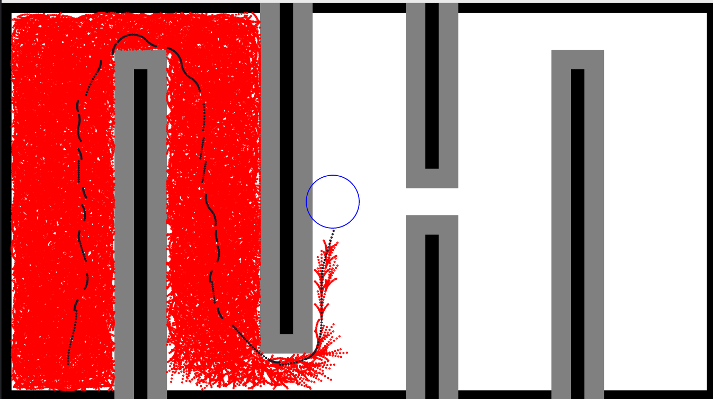

# ENPM661 Project 03 Phase 02 Part1 - A* Algorithm Implementation on Non Holonomic Robot

## Overview
We used Euler Integration to compute the Non holonomic paths for Differential drive robot. 
The robot's movement is constrained by its differential drive, which limits its motion in the y-direction. The A* algorithm is modified to incorporate these constraints.

## Map

The user inputs are in **mm** and with respect to the frame drawn above. 

## Usage
```bash
python3 search.py
```

## Output Example
```bash
Enter robot clearance (in mm): 5
Preparing Canvas
Enter Start Coordinates (x y):
Start (x y θ) [Note: (0 ≤ x ≤ 5399), (-1499 ≤ y ≤ 2999), (-180 ≤ θ < 180)]: 500 -1250 90
Start point validated: Start (x y θ) in map = (500.0, 2749.9965122507338, -90.0)
Enter Goal Coordinates (x y R):
Goal (x y R) [Note: (0 ≤ x ≤ 5399), (-1499 ≤ y ≤ 2999)]: 2500 0 200
Goal point validated: Goal (x y R) in map = (2500.0, 1499.9980975913093, 200)
Enter Wheel RPMs (RPM1 RPM2) (must be > 0): 50 75
Wheel RPMs validated: (RPM1 RPM2) = (50.0, 75.0)
Start:Node(x=500.0, y=2749.9965122507338, θ=-90.0, c2c=0, totalcost=2358.4944427857095)
Goal:GoalPt(x=2500.0, y=1499.9980975913093, radius=200)
Goal found near waypoint at Node(x=2514.522812252164, y=1696.5201588414643, θ=-72.75260625441385, c2c=5978.450819781374, totalcost=6175.508762107283)
Program terminated.
Search success, path found
Map generated in  16.48741247098951 seconds
ASTAR 127.35870578199683 seconds
Backtracking 3.234899486415088e-05 seconds
```




## Implementation Notes
To make the project more readable and manageable, the project is distributed in multiple files. 
- canvas.py contains Canvas class which creates CV mat and populates it with obstacles. 
- helpers.py contains custom classes like Node, Waypoint
- robot.py contains robot specific implementation of methods such as euler integration
- search.py contains the search class with a_star as method


## Dependencies
- Python 3.x
- numpy
- matplotlib
- opencv-python

## License
This project is licensed under the Apache2.0 License - see the [LICENSE](LICENSE) file for details.

