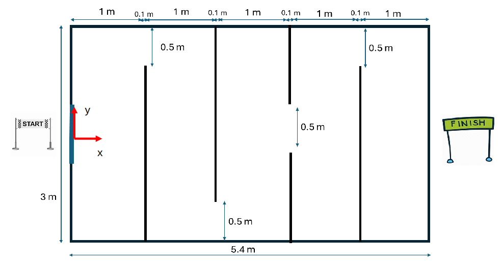
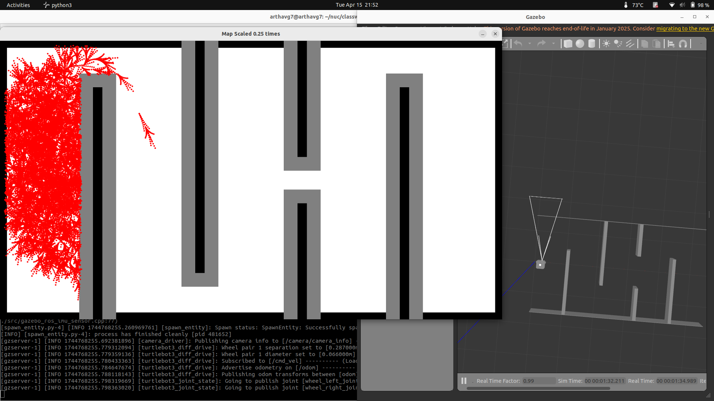

# ENPM 661: Path Planning for Autonomous Robots
### Instructions for Project3- Phase2

Forked from template which has been modified as per requirements- https://github.com/koustubh1012/turtlebot3_project3 
## Map

The user inputs are with respect to the frame drawn above. 

## How to run

Package can either be copied in the src of workspace or a symbolic link can be created.
```sh
mkdir project3_ws
cd project3_ws
git clone git@github.com:munyaradziantony/A-Algorithm-Implementation-on-TurtleBot3.git
mkdir src
cp -r A-Algorithm-Implementation-on-TurtleBot3/part2 src/ 
#or 
ln -snf $PWD/A-Algorithm-Implementation-on-TurtleBot3/part2 src/pkg
# To compile
colcon build --cmake-args -DCMAKE_EXPORT_COMPILE_COMMANDS=ON --event-handlers console_cohesion+
# Source the package
source install/setup.bash
```

## Test Setup

Launch Environment

```sh
ros2 launch turtlebot3_project3 competition_world.launch x_pose:=0.2 y_pose:=0 yaw:=1.57
```

Run A* pathfinder
```bash
ros2 run turtlebot3_project3 a_start_path.py
```
Input the start and goal positions in **mm** and **degree**

## Output Example
```bash
Enter robot clearance (in mm): 5
Preparing Canvas
Enter Start Coordinates (x y):
Start (x y θ) [Note: (0 ≤ x ≤ 5399), (-1499 ≤ y ≤ 1499.0), (-180 ≤ θ < 180)]: 200 0 90 
Start point validated: Start (x y θ) in map = (200.0, 1499.9980975913093, -90.0)
Enter Goal Coordinates (x y R):
Goal (x y R) [Note: (0 ≤ x ≤ 5399), (-1499 ≤ y ≤ 1499.0)]: 1800 0 200
Goal point validated: Goal (x y R) in map = (1800.0, 1499.9980975913093, 200)
Enter Wheel RPMs (RPM1 RPM2) (must be > 0): 25 75
Wheel RPMs validated: (RPM1 RPM2) = (25.0, 75.0)
Start:Node(x=200.0, y=1499.9980975913093, θ=-90.0, c2c=0, totalcost=1600.0)
Goal:GoalPt(x=1800.0, y=1499.9980975913093, radius=200)
Goal found near waypoint at Node(x=1713.9782294212048, y=1323.6796671826773, θ=94.5470458686766, c2c=2017.2951826863457, totalcost=2213.4786017494116)
```

You should see the turtlebot3 along with the maze in gazebo



**NOTE:** OpenCV visualizer blocks thread please close the path viz window to begin publishing velocities. 

## Dependencies
- Python 3.x
- numpy
- matplotlib
- opencv-python
- rclpy
